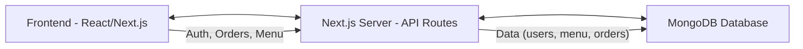
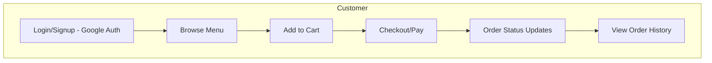
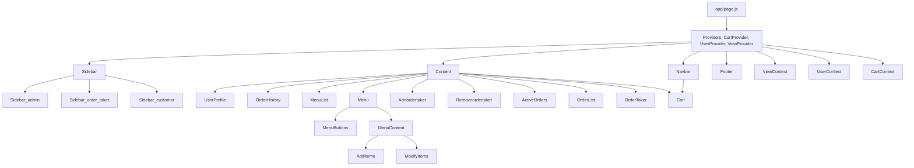
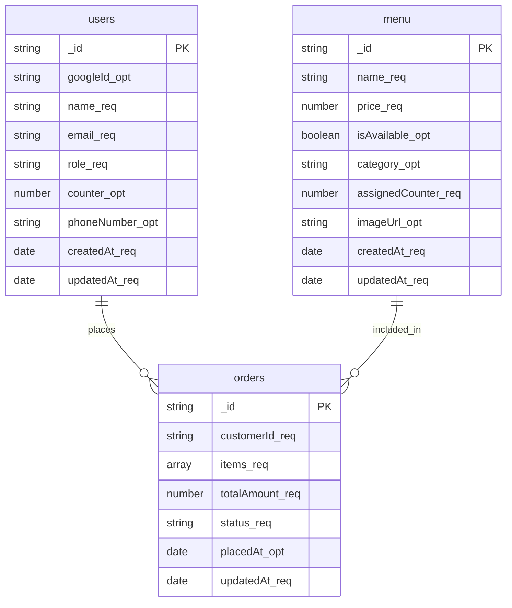
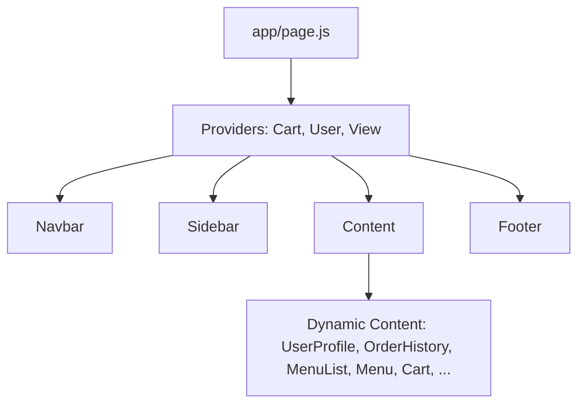
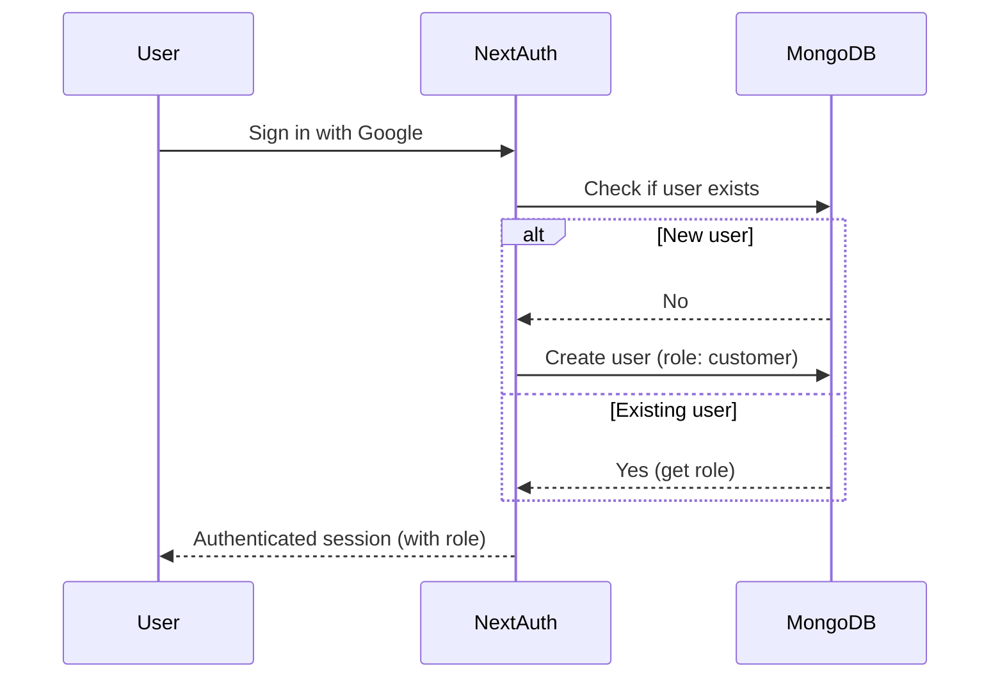

# Canteen-X

End-to-end canteen solution

---

## Table of Contents

- [Project Overview](#project-overview)
- [Architecture Diagram](#architecture-diagram)
- [User Roles & Flow](#user-roles--flow)
- [Component & File Mapping](#component--file-mapping)
- [Component Usage Block Diagram](#component-usage-block-diagram)
- [Database Schema](#database-schema)
- [Component Flow](#component-flow)
- [Authentication Flow](#authentication-flow)
- [Payment Integration](#payment-integration)
- [Styling](#styling)
- [Extending the Project](#extending-the-project)
- [References](#references)

---

## Project Overview

Canteen-X is a full-stack canteen management platform supporting three user roles: **Admin**, **Order Taker**, and **Customer**. It manages menu items, orders, and user profiles, and supports Google authentication.

---

## Architecture Diagram

---

## User Roles & Flow

### Roles

- **Admin**: Manages menu and order takers, views all orders.
- **Order Taker**: Handles orders for their counter, updates order status.
- **Customer**: Browses menu, places orders, views order history.

### User Flow

---

## Component & File Mapping

| Component/File                | Purpose/Role                                 |
|-------------------------------|----------------------------------------------|
| `app/page.js`                 | Main entry, wraps everything in providers    |
| `components/Navbar.js`        | Top navigation bar, role-aware               |
| `components/Sidebar.js`       | Sidebar navigation (role-based)              |
| `components/Content.js`       | Renders main content based on view/role      |
| `components/Cart.js`          | Shopping cart and payment                    |
| `components/UserProfile.js`   | User profile page                            |
| `components/OrderHistory.js`  | Customer's order history                     |
| `components/ActiveOrders.js`  | Order taker's active orders                  |
| `components/OrderList.js`     | Admin's order list                           |
| `components/MenuList.js`      | Menu display for customers                   |
| `components/Menu.js`          | Menu management for admin                    |
| `components/Addordertaker.js` | Admin tool: add order taker                  |
| `components/Removeordertaker.js` | Admin tool: remove order taker            |
| `context/ViewContext.js`      | Controls which view is active                |
| `context/UserContext.js`      | User info and session                        |
| `context/CartContext.js`      | Cart state                                   |
| `app/api/`                    | API routes for auth, orders, menu, etc.      |
| `models/usermodel.js`         | User schema                                  |
| `models/menumodel.js`         | Menu item schema                             |
| `models/ordersmodel.js`       | Order schema                                 |

---

## Component Usage Block Diagram

---

## Database Schema

### Legend
- `_req` = Required (compulsory) field
- `_opt` = Optional field

---

## Component Flow

- **Content** dynamically renders the correct component based on the current view and user role.

---

## Authentication Flow

- Uses **NextAuth** with Google provider.
- On sign-in, user is created in the database if not present.
- Role is determined from the database and attached to the session.

---

## Payment Integration

- Uses **Cashfree** for payment processing in the cart (`components/Cart.js`).
- Payment is only allowed for logged-in users.
- Unavailable items are checked before payment.

---

## Styling

- All styles are modular and located in the `styles/` directory.
- Uses CSS variables for theme consistency.
- Responsive and modern UI.

---

## Extending the Project

- Add new roles by updating `usermodel.js` and role-based logic in components.
- Add new menu categories or order statuses by updating the respective models and UI.

---

## References

- See `Documentation.md` and `README.md` for more.
- Each component's file contains inline documentation.

---

**Tip:**  
To view diagrams, use a Markdown viewer that supports Mermaid (e.g., VSCode with the Markdown Preview Mermaid Support extension, or GitHub web).

---

Let me know if you want any branding/customization! 